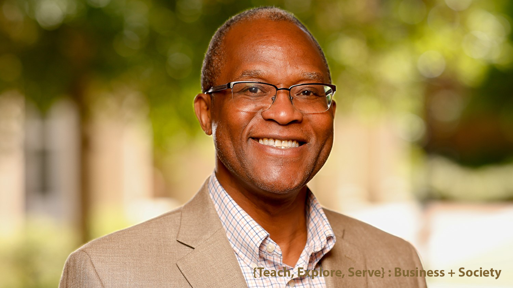

 

I am an assistant professor in the Management Information Systems Department at the Terry College of Business, University of Georgia. I obtained my Bachelors and Masters of Architecture degrees from Tsinghua University, Beijing, China, Master of Community Planning (MCP) from the University of Cincinnati, a Master of Science (MS) in Information Systems, and a Ph.D. in Computer Science and Information Systems from the University of Colorado Denver. My research interests are in Human-AI Assemblages, AI Governance, Digital Transformation, Technology Affordance-Based Control, and IT for Development (IT4D). My research has been published in top-tier journals, including MIS Quarterly, Journal of Management Information Systems, Policing and Society, and various conference proceedings.

I am fluent in five languages, including Chinese, Krio, and French.

## Research Areas

* Human-Machine Assemblages
* Organization Theory and Research Methods
* IT Governance and Sourcing
* Technology Affordance-based Organization Control
* Digital Transformation in Organizations & Digital Government
* Information Technology for Development (IT4D)
* Data Modeling and Business Analytics

    

